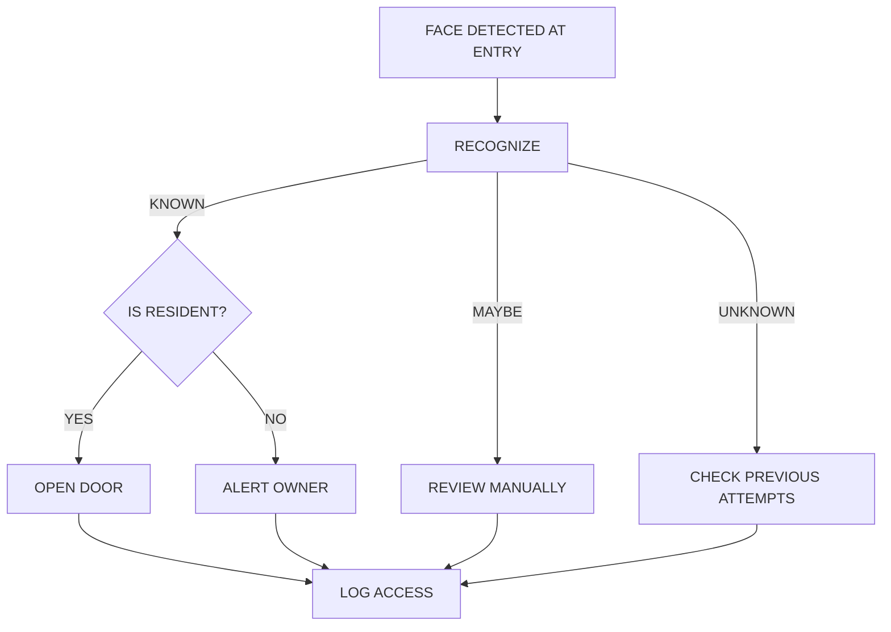
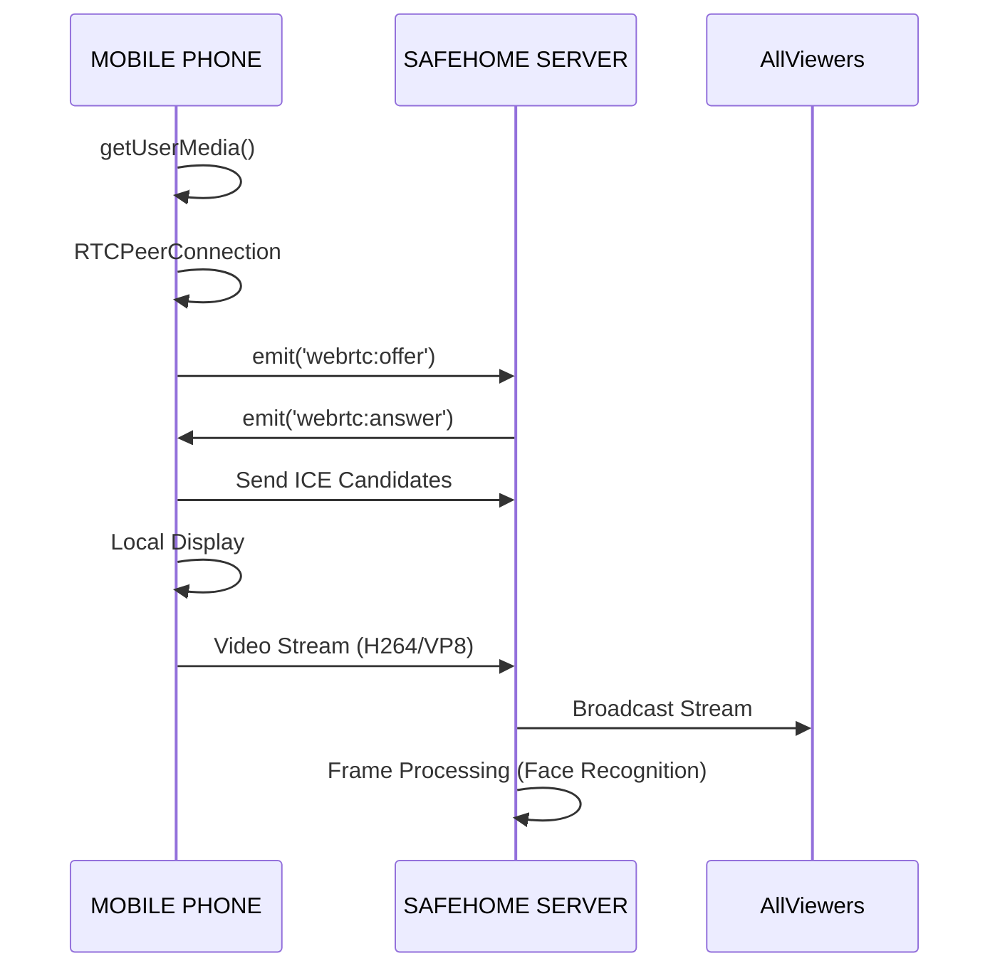
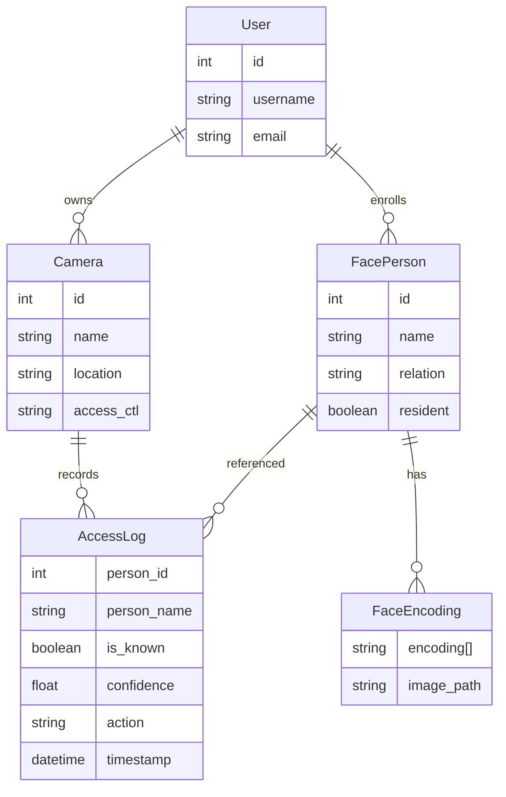
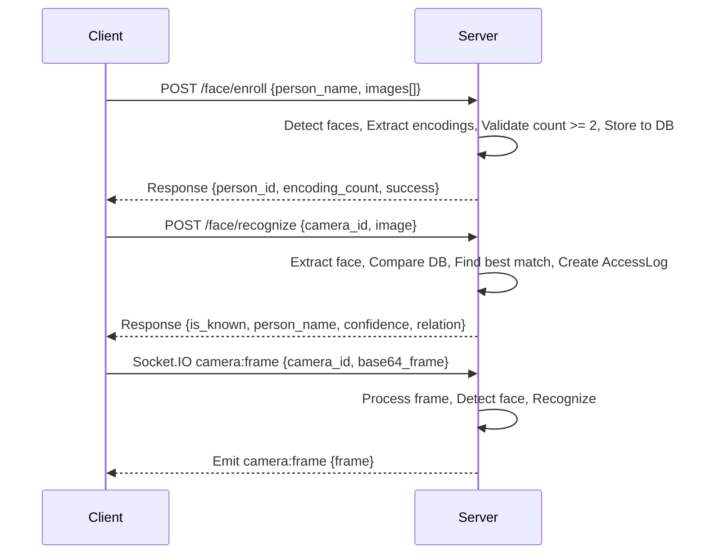
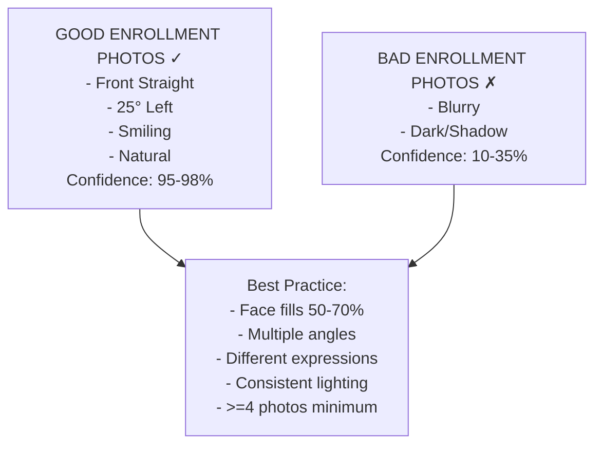
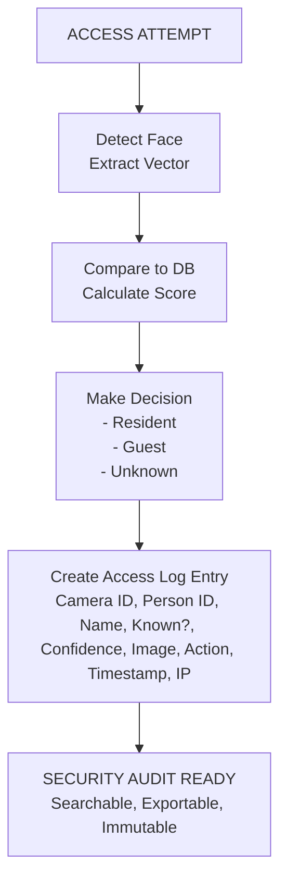

Perfect — let’s translate your **SafeHome Face Recognition System Architecture & Flow Diagrams** into **Mermaid syntax**. I’ll provide each section as a separate Mermaid diagram so you can copy-paste them directly into your documentation or visualization tools.

---

## 1. Overall System Architecture
```mermaid
flowchart TD
    subgraph SAFEHOME[SAFEHOME ECOSYSTEM]
        Phone1[Phone 1 (Camera)]
        FrontDoor[Front Door (RTSP)]
        BackDoor[Back Door (MJPEG)]
        Garage[Garage (HTTP)]

        Phone1 -->|WebRTC| SafehomeServer

        FrontDoor --> SafehomeServer
        BackDoor --> SafehomeServer
        Garage --> SafehomeServer

        subgraph SafehomeServer[SAFEHOME SERVER]
            FRService[FR Service\n- Encoding\n- Matching\n- Decision]
            Database[Database\n- FacePerson\n- FaceEncoding\n- AccessLog]
            WebRTCManager[WebRTC Manager\n- Signaling\n- Stream Routing]
        end

        SafehomeServer --> DoorOpener[DOOR OPENER]
        SafehomeServer --> Alerts[ALERTS (Email)]
    end
```

---

## 2. Face Recognition Flow
```mermaid
flowchart TD
    Camera[CAMERA CAPTURE] --> Detect[Detect Face(s)\n(dlib CNN)]
    Detect --> Encode[Extract Encoding\n(128-dim vector)]
    Encode --> Compare[Compare Against DB\nFind Closest Match]
    Compare --> Decision{Distance < 0.6?}
    Decision -->|YES| Known[KNOWN PERSON]
    Decision -->|NO| Unknown[UNKNOWN PERSON]
    Known --> Resident{Is Resident?}
    Unknown --> Resident
    Resident -->|YES| Open[OPEN DOOR]
    Resident -->|NO| Alert[SEND ALERT (Guest/Unknown)]
    Open --> Log[LOG ACCESS]
    Alert --> Log
```

---

## 3. Face Enrollment Flow
```mermaid
flowchart TD
    User[USER SELECTS IMAGES] --> Load[Load Image Files]
    Load --> ForEach[FOR EACH IMAGE\nDetect Face(s)\nExtract Encoding]
    ForEach --> Store[Store Encoding + Image Path + Timestamp]
    Store --> Count{Encoding Count >= 2?}
    Count -->|YES| Create[Create FacePerson\n- Name\n- Relation\n- Resident\n- Profile_image]
    Count -->|NO| Reject[REJECT (Need more photos)]
    Create --> Success[Person Enrolled ✓\nID: 123\nEncodings: 5]
```

---

## 4. Access Control Decision Tree


---

## 5. Multi-Camera Real-time Processing
```mermaid
flowchart TD
    C1[Camera 1 (Front Door)] --> FramePool
    C2[Camera 2 (Mobile)] --> FramePool
    C3[Camera 3 (Back Door)] --> FramePool

    FramePool[FRAME POOL Processing] --> FR1[FR-1 Engine]
    FramePool --> FR2[FR-2 Engine]
    FramePool --> FR3[FR-3 Engine]

    FR1 --> AccessLog
    FR2 --> AccessLog
    FR3 --> AccessLog

    AccessLog[Access Log (All Results)]
```

---

## 6. Mobile Camera WebRTC Flow


---

## 7. Database Relationship Diagram


---

## 8. API Call Sequence Diagram


---

## 9. Enrollment Photo Requirements


---

## 10. System Performance Timeline

```mermaid
gantt
    title System Performance Timeline
    dateFormat  x
    axisFormat  %L ms

    section Processing
    Camera detects motion :0, 10
    Capture frame :10, 40
    Detect face (dlib) :50, 50
    Extract encoding :100, 50
    Query database :150, 50
    Compare persons :200, 50
    Calculate confidence :250, 50
    Make decision :300, 50
    Store AccessLog :350, 50
    Door opens/Alert sent :400, 50
    Email notification queued :450, 50
```


---

## 11. Scalability Architecture
```mermaid
flowchart TD
    subgraph Current[CURRENT (Single Server)]
        Flask[Flask App\n- Routes\n- Logic\n- Processing]
        DB[SQLite/PostgreSQL]
        Flask --> DB
    end

    subgraph Future[FUTURE (Scaled Architecture)]
        LB[LOAD BALANCER (nginx)]
        App1[App 1 (FR)]
        App2[App 2 (FR)]
        App3[App 3 (FR)]
        DB2[PostgreSQL (Data)]
        Cache[Redis (Cache)]

        LB --> App1
        LB --> App2
        LB --> App3
        App1 --> DB2
        App2 --> DB2
        App3 --> DB2
        App1 --> Cache
        App2 --> Cache
        App3 --> Cache
    end
```

---

## 12. Security & Audit Flow


---

✅ Now you have **Mermaid diagrams** for all 12 sections of your architecture.  
Would you like me to bundle these into a **single `.md` file with all diagrams** so you can directly render them in one place?
