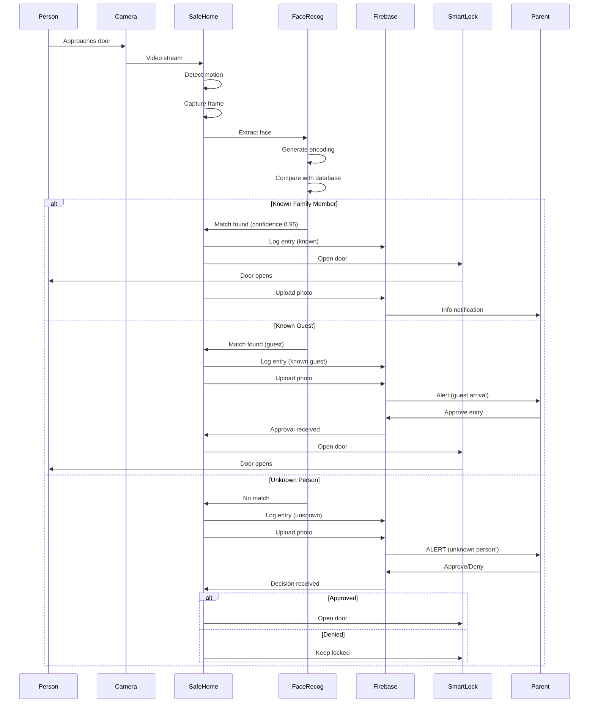
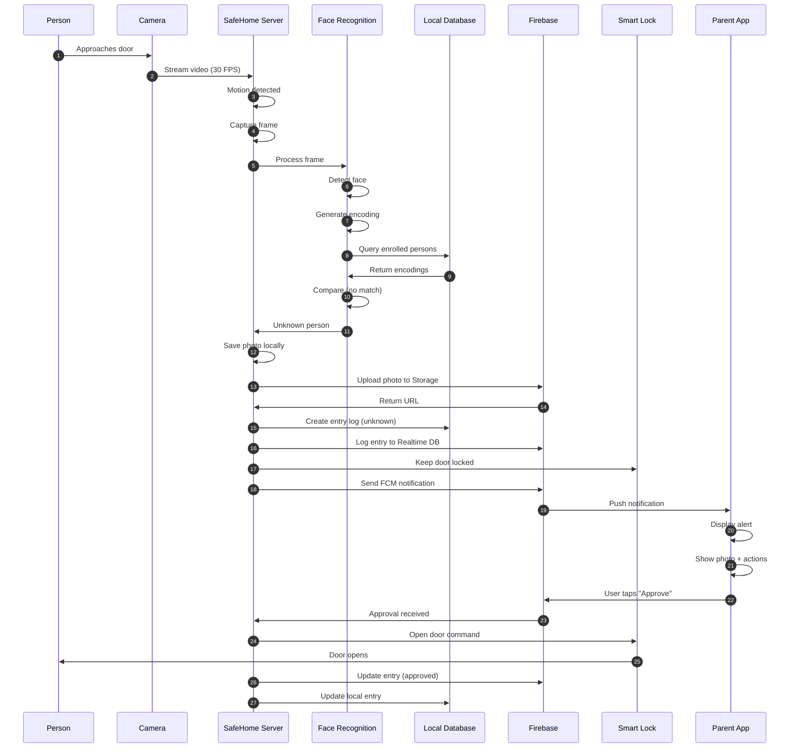
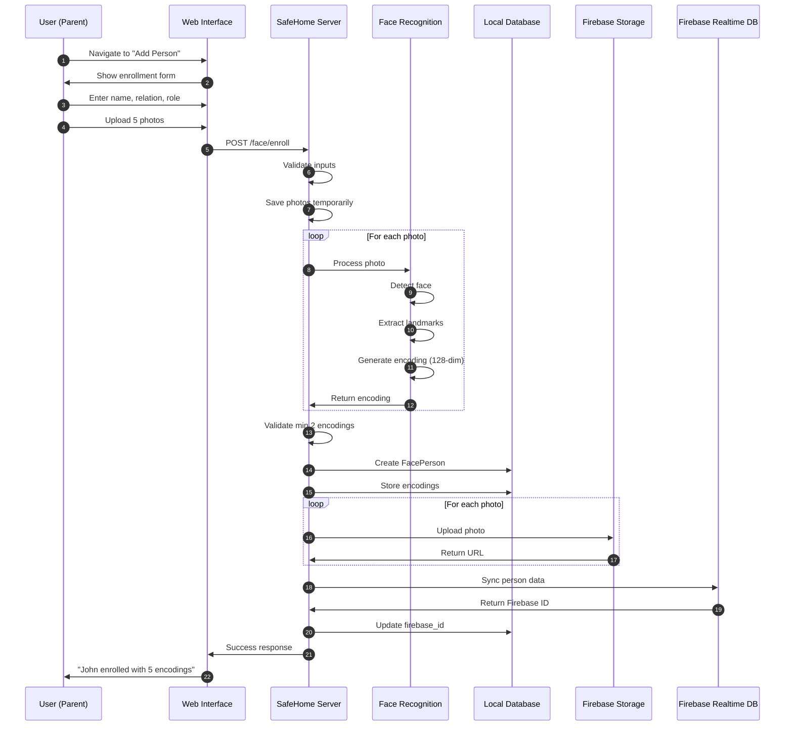

# 🏗️ SafeHome - Architecture & System Diagrams

## 📋 Table of Contents
1. [System Overview](#system-overview)
2. [High-Level Architecture](#high-level-architecture)
3. [Data Flow Diagrams](#data-flow-diagrams)
4. [Database Schema](#database-schema)
5. [Firebase Integration](#firebase-integration)
6. [Component Diagrams](#component-diagrams)
7. [Sequence Diagrams](#sequence-diagrams)
8. [Deployment Architecture](#deployment-architecture)

---

## 🎯 System Overview

### Purpose
SafeHome is an intelligent home access control system that monitors who enters and exits your home, using facial recognition to automatically grant access to family members while requiring manual approval for unknown persons.

### Key Components
1. **Face Recognition Engine** - Identifies known vs unknown persons
2. **Firebase Cloud Backend** - Stores face data, entry logs, notifications
3. **Camera Integration** - Supports multiple camera types
4. **Smart Lock Control** - Automatic door opening
5. **Notification System** - Real-time alerts to parents/guardians
6. **Entry Logging** - Complete audit trail

---

## 🏛️ High-Level Architecture

### System Architecture Diagram

```
┌─────────────────────────────────────────────────────────────────────┐
│                         USER DEVICES                                 │
│  ┌──────────┐   ┌──────────┐   ┌──────────┐   ┌──────────┐        │
│  │ Parent   │   │ Parent   │   │  Child   │   │  Admin   │        │
│  │ Phone 1  │   │ Phone 2  │   │  Tablet  │   │   Web    │        │
│  └────┬─────┘   └────┬─────┘   └────┬─────┘   └────┬─────┘        │
└───────┼──────────────┼──────────────┼──────────────┼───────────────┘
        │              │              │              │
        └──────────────┼──────────────┼──────────────┘
                       │              │
                ┌──────▼──────────────▼──────┐
                │   FIREBASE CLOUD SERVICES   │
                │ ┌────────────────────────┐  │
                │ │ Firebase Auth          │  │ User Management
                │ ├────────────────────────┤  │
                │ │ Realtime Database      │  │ Entry Logs, Sync
                │ ├────────────────────────┤  │
                │ │ Cloud Storage          │  │ Photos
                │ ├────────────────────────┤  │
                │ │ Cloud Messaging (FCM)  │  │ Push Notifications
                │ └────────────────────────┘  │
                └──────┬──────────────────────┘
                       │ API calls
                ┌──────▼──────────────────────┐
                │   SAFEHOME SERVER (Flask)   │
                │ ┌────────────────────────┐  │
                │ │ Face Recognition       │  │ Face detection & matching
                │ │ Service                │  │
                │ ├────────────────────────┤  │
                │ │ Camera Manager         │  │ Stream handling
                │ ├────────────────────────┤  │
                │ │ Door Control           │  │ Smart lock integration
                │ ├────────────────────────┤  │
                │ │ Notification Service   │  │ Alert distribution
                │ ├────────────────────────┤  │
                │ │ Entry Logger           │  │ Audit trail
                │ └────────────────────────┘  │
                └──────┬──────────────────────┘
                       │
        ┌──────────────┼──────────────┐
        │              │              │
   ┌────▼─────┐  ┌────▼─────┐  ┌────▼─────┐
   │ Phone    │  │ IP       │  │ Doorbell │
   │ Camera   │  │ Camera   │  │ Camera   │
   │ (Mobile) │  │ (WiFi)   │  │ (WiFi)   │
   └──────────┘  └──────────┘  └──────────┘
        │              │              │
        └──────────────┼──────────────┘
                       │
                  ┌────▼────┐
                  │ Smart   │
                  │ Lock    │
                  │ (WiFi)  │
                  └─────────┘
```

### Technology Stack

```
┌─────────────────────────────────────────────────────────────┐
│                     FRONTEND LAYER                          │
│  ┌───────────┐  ┌───────────┐  ┌───────────┐              │
│  │  Web UI   │  │  Mobile   │  │  WebRTC   │              │
│  │ HTML/CSS/ │  │  Browser  │  │  Camera   │              │
│  │    JS     │  │  (PWA)    │  │  Stream   │              │
│  └─────┬─────┘  └─────┬─────┘  └─────┬─────┘              │
└────────┼──────────────┼──────────────┼─────────────────────┘
         │              │              │
┌────────┼──────────────┼──────────────┼─────────────────────┐
│        │       COMMUNICATION LAYER   │                      │
│  ┌─────▼─────┐  ┌─────▼─────┐  ┌────▼──────┐             │
│  │ REST API  │  │ Socket.IO │  │  Firebase  │             │
│  │   HTTP    │  │ WebSocket │  │    SDK     │             │
│  └─────┬─────┘  └─────┬─────┘  └────┬──────┘             │
└────────┼──────────────┼──────────────┼─────────────────────┘
         │              │              │
┌────────┼──────────────┼──────────────┼─────────────────────┐
│        │      APPLICATION LAYER      │                      │
│  ┌─────▼───────────────────────────────────────┐           │
│  │         Flask Application (Python)           │           │
│  │  ┌──────────────────────────────────────┐  │           │
│  │  │ Routes (API Endpoints)                │  │           │
│  │  ├──────────────────────────────────────┤  │           │
│  │  │ Services (Business Logic)             │  │           │
│  │  │ • Face Recognition Service            │  │           │
│  │  │ • Firebase Service                    │  │           │
│  │  │ • Camera Service                      │  │           │
│  │  │ • Notification Service                │  │           │
│  │  │ • Door Control Service                │  │           │
│  │  ├──────────────────────────────────────┤  │           │
│  │  │ Background Tasks (Celery)             │  │           │
│  │  └──────────────────────────────────────┘  │           │
│  └────────────────┬─────────────────────────┬─┘           │
└───────────────────┼─────────────────────────┼─────────────┘
                    │                         │
┌───────────────────┼─────────────────────────┼─────────────┐
│           DATA LAYER                        │              │
│  ┌────────┴────────┐                  ┌─────▼────────┐    │
│  │  Local SQLite   │                  │   Firebase    │    │
│  │   Database      │ ◄─sync─────────► │   Realtime    │    │
│  │                 │                  │   Database    │    │
│  │ • Users         │                  │ • Entries     │    │
│  │ • Cameras       │                  │ • Persons     │    │
│  │ • Face Persons  │                  │ • Devices     │    │
│  │ • Encodings     │                  │               │    │
│  │ • Entry Logs    │                  └───────────────┘    │
│  └─────────────────┘                                       │
│                                                             │
│  ┌──────────────────────────────────────────────┐         │
│  │          Firebase Cloud Storage              │         │
│  │  • Face enrollment photos                    │         │
│  │  • Entry detection images                    │         │
│  │  • Profile pictures                          │         │
│  └──────────────────────────────────────────────┘         │
└─────────────────────────────────────────────────────────────┘
```

---

## 📊 Data Flow Diagrams

### 1. Person Enters Home - Complete Flow



### 2. Face Enrollment Flow

```
USER (Parent)
    │
    ├─► Select "Add Person"
    │
    ├─► Enter Details
    │   ├─ Name: "John Doe"
    │   ├─ Relation: Family
    │   └─ Resident: Yes
    │
    ├─► Upload Photos (4-6 images)
    │   ├─ Front view
    │   ├─ Left angle
    │   ├─ Right angle
    │   └─ Smiling
    │
    ▼
SAFEHOME SERVER
    │
    ├─► FOR EACH PHOTO:
    │   ├─ Load image
    │   ├─ Detect face
    │   ├─ Extract 68 landmarks
    │   └─ Generate 128-dim encoding
    │
    ├─► Validate (min 2 encodings)
    │
    ├─► Store in Local DB
    │   ├─ FacePerson record
    │   └─ Multiple FaceEncoding records
    │
    ├─► Upload to Firebase Storage
    │   └─ /faces/john_doe/
    │
    └─► Sync to Firebase Realtime DB
        └─ /persons/john_doe
    
RESULT: Person enrolled successfully
    ├─ Can now be recognized
    └─ Door access granted (if resident)
```

### 3. Real-Time Notification Flow

```
EVENT: Unknown Person Detected
    │
    ▼
SAFEHOME SERVER
    │
    ├─► Create Entry Log
    │   ├─ Local SQLite
    │   └─ Firebase Realtime DB
    │
    ├─► Upload Photo
    │   └─ Firebase Storage
    │
    ├─► Prepare Notification
    │   ├─ Title: "🚨 Unknown Person at Front Door"
    │   ├─ Body: "Unrecognized face detected"
    │   ├─ Image: Firebase Storage URL
    │   └─ Data: { entry_id, timestamp, action_required }
    │
    └─► Send via Firebase Cloud Messaging
        │
        ├─► Parent Phone 1 (FCM Token 1)
        │   └─ Push Notification appears
        │
        ├─► Parent Phone 2 (FCM Token 2)
        │   └─ Push Notification appears
        │
        └─► Admin Web Dashboard
            └─ Real-time update via Socket.IO
    
PARENT RECEIVES:
    ├─► Notification with photo
    ├─► "Approve Entry" button
    ├─► "Deny Entry" button
    └─► "View Details" button
    
PARENT ACTIONS:
    │
    ├─► Approve
    │   └─► Door opens
    │
    └─► Deny
        └─► Door stays locked
```

---

## 🗄️ Database Schema

### Local SQLite Schema

```sql
-- Users (Parents/Guardians)
CREATE TABLE users (
    id INTEGER PRIMARY KEY AUTOINCREMENT,
    username VARCHAR(80) UNIQUE NOT NULL,
    email VARCHAR(120) UNIQUE NOT NULL,
    password_hash VARCHAR(255) NOT NULL,
    role VARCHAR(20) DEFAULT 'admin',  -- admin, user
    created_at TIMESTAMP DEFAULT CURRENT_TIMESTAMP
);

-- Firebase Device Tokens
CREATE TABLE device_tokens (
    id INTEGER PRIMARY KEY AUTOINCREMENT,
    user_id INTEGER NOT NULL,
    token VARCHAR(255) UNIQUE NOT NULL,
    device_type VARCHAR(20),  -- ios, android, web
    created_at TIMESTAMP DEFAULT CURRENT_TIMESTAMP,
    FOREIGN KEY (user_id) REFERENCES users(id) ON DELETE CASCADE
);

-- Cameras/Entry Points
CREATE TABLE cameras (
    id INTEGER PRIMARY KEY AUTOINCREMENT,
    user_id INTEGER NOT NULL,
    name VARCHAR(100) NOT NULL,  -- "Front Door"
    location VARCHAR(100),  -- "Main Entrance"
    camera_type VARCHAR(20),  -- mobile, ip, usb
    stream_url VARCHAR(255),  -- For IP cameras
    is_active BOOLEAN DEFAULT TRUE,
    face_detection_enabled BOOLEAN DEFAULT TRUE,
    created_at TIMESTAMP DEFAULT CURRENT_TIMESTAMP,
    FOREIGN KEY (user_id) REFERENCES users(id) ON DELETE CASCADE
);

-- Enrolled Persons
CREATE TABLE face_persons (
    id INTEGER PRIMARY KEY AUTOINCREMENT,
    user_id INTEGER NOT NULL,
    name VARCHAR(100) NOT NULL,
    relation VARCHAR(50),  -- family, guest, staff
    is_resident BOOLEAN DEFAULT TRUE,  -- Can open doors?
    profile_image VARCHAR(255),
    firebase_id VARCHAR(100),
    enrolled_date TIMESTAMP DEFAULT CURRENT_TIMESTAMP,
    last_seen TIMESTAMP,
    FOREIGN KEY (user_id) REFERENCES users(id) ON DELETE CASCADE
);

-- Face Encodings (128-dimensional vectors)
CREATE TABLE face_encodings (
    id INTEGER PRIMARY KEY AUTOINCREMENT,
    person_id INTEGER NOT NULL,
    encoding_data TEXT NOT NULL,  -- JSON array of 128 floats
    image_path VARCHAR(255),
    created_at TIMESTAMP DEFAULT CURRENT_TIMESTAMP,
    FOREIGN KEY (person_id) REFERENCES face_persons(id) ON DELETE CASCADE
);

-- Entry Logs (Local copy, synced with Firebase)
CREATE TABLE entry_logs (
    id INTEGER PRIMARY KEY AUTOINCREMENT,
    firebase_id VARCHAR(100),
    camera_id INTEGER,
    person_id INTEGER,
    person_name VARCHAR(100),
    is_known BOOLEAN DEFAULT FALSE,
    confidence FLOAT,
    image_path VARCHAR(255),  -- Local path
    firebase_image_url VARCHAR(500),  -- Firebase Storage URL
    action VARCHAR(50),  -- door_opened, entry_denied, pending_approval
    approved_by INTEGER,
    timestamp TIMESTAMP DEFAULT CURRENT_TIMESTAMP,
    FOREIGN KEY (camera_id) REFERENCES cameras(id),
    FOREIGN KEY (person_id) REFERENCES face_persons(id),
    FOREIGN KEY (approved_by) REFERENCES users(id)
);

-- Indexes for performance
CREATE INDEX idx_entry_logs_timestamp ON entry_logs(timestamp DESC);
CREATE INDEX idx_entry_logs_person ON entry_logs(person_id);
CREATE INDEX idx_entry_logs_camera ON entry_logs(camera_id);
CREATE INDEX idx_face_encodings_person ON face_encodings(person_id);
```

### Firebase Realtime Database Schema

```json
{
  "persons": {
    "john_doe": {
      "name": "John Doe",
      "relation": "family",
      "is_resident": true,
      "enrolled_date": 1707832800000,
      "encoding_count": 5,
      "last_seen": 1707832825000,
      "profile_image_url": "gs://safehome/faces/john_doe/profile.jpg"
    },
    "jane_smith": {
      "name": "Jane Smith",
      "relation": "guest",
      "is_resident": false,
      "enrolled_date": 1707833000000,
      "encoding_count": 3,
      "last_seen": 1707835000000
    }
  },
  
  "entries": {
    "entry_001": {
      "person_id": "john_doe",
      "person_name": "John Doe",
      "camera_id": "front_door",
      "camera_name": "Front Door",
      "is_known": true,
      "confidence": 0.95,
      "action": "door_opened",
      "timestamp": 1707832825000,
      "image_url": "https://storage.googleapis.com/safehome/entries/entry_001.jpg",
      "approved_by": null
    },
    "entry_002": {
      "person_id": null,
      "person_name": "Unknown Person",
      "camera_id": "front_door",
      "camera_name": "Front Door",
      "is_known": false,
      "confidence": 0.0,
      "action": "pending_approval",
      "timestamp": 1707833000000,
      "image_url": "https://storage.googleapis.com/safehome/entries/entry_002.jpg",
      "approved_by": null,
      "pending_approval": true
    }
  },
  
  "cameras": {
    "front_door": {
      "name": "Front Door",
      "location": "Main Entrance",
      "type": "mobile",
      "is_active": true,
      "last_activity": 1707832825000
    },
    "back_door": {
      "name": "Back Door",
      "location": "Backyard",
      "type": "ip",
      "is_active": true,
      "stream_url": "rtsp://192.168.1.100:554/stream",
      "last_activity": 1707830000000
    }
  },
  
  "notifications": {
    "notif_001": {
      "user_id": "parent_1",
      "title": "Unknown Person at Front Door",
      "body": "Unrecognized face detected at 2:30 PM",
      "type": "alert",
      "entry_id": "entry_002",
      "read": false,
      "timestamp": 1707833000000
    }
  },
  
  "users": {
    "parent_1": {
      "username": "dad",
      "email": "dad@family.com",
      "role": "admin",
      "device_tokens": {
        "token_1": {
          "token": "fcm_token_string_here",
          "device_type": "ios",
          "last_active": 1707833000000
        }
      }
    }
  }
}
```

### Firebase Storage Structure

```
safehome-xxxxx.appspot.com/
│
├── faces/
│   ├── john_doe/
│   │   ├── profile.jpg
│   │   ├── enrollment_1.jpg
│   │   ├── enrollment_2.jpg
│   │   ├── enrollment_3.jpg
│   │   └── enrollment_4.jpg
│   │
│   ├── jane_smith/
│   │   ├── profile.jpg
│   │   ├── enrollment_1.jpg
│   │   └── enrollment_2.jpg
│   │
│   └── sarah_jones/
│       └── ...
│
├── entries/
│   ├── 2026-02/
│   │   ├── entry_001.jpg
│   │   ├── entry_002.jpg
│   │   └── entry_003.jpg
│   │
│   └── 2026-01/
│       └── archived entries
│
└── temp/
    └── temporary uploads
```

---

## 🔥 Firebase Integration Architecture

### Component Interaction

```
┌────────────────────────────────────────────────────────────┐
│                   FIREBASE SERVICES                        │
│                                                            │
│  ┌──────────────┐  ┌──────────────┐  ┌──────────────┐    │
│  │ Realtime DB  │  │   Storage    │  │   Messaging  │    │
│  │              │  │              │  │    (FCM)     │    │
│  │ • Entries    │  │ • Photos     │  │ • Push       │    │
│  │ • Persons    │  │ • Images     │  │   Alerts     │    │
│  │ • Sync Data  │  │ • Backups    │  │ • Rich media │    │
│  └───────┬──────┘  └───────┬──────┘  └───────┬──────┘    │
└──────────┼─────────────────┼─────────────────┼───────────┘
           │                 │                 │
           │ Firebase Admin SDK                │
           │                 │                 │
┌──────────▼─────────────────▼─────────────────▼───────────┐
│              SAFEHOME SERVER (Flask)                      │
│                                                            │
│  ┌────────────────────────────────────────────────────┐  │
│  │         Firebase Service (app/services/)           │  │
│  │  ┌──────────────────────────────────────────────┐  │  │
│  │  │ def log_entry(entry_data)                    │  │  │
│  │  │     • Write to Realtime DB                   │  │  │
│  │  │     • Return entry_id                        │  │  │
│  │  ├──────────────────────────────────────────────┤  │  │
│  │  │ def upload_image(local_path, storage_path)   │  │  │
│  │  │     • Upload to Storage                      │  │  │
│  │  │     • Return public URL                      │  │  │
│  │  ├──────────────────────────────────────────────┤  │  │
│  │  │ def send_push_notification(tokens, data)     │  │  │
│  │  │     • Send via FCM                           │  │  │
│  │  │     • Return response                        │  │  │
│  │  ├──────────────────────────────────────────────┤  │  │
│  │  │ def sync_person(person_data)                 │  │  │
│  │  │     • Upload to Realtime DB                  │  │  │
│  │  │     • Upload photos to Storage               │  │  │
│  │  └──────────────────────────────────────────────┘  │  │
│  └────────────────────────────────────────────────────┘  │
│                                                            │
│  ┌────────────────────────────────────────────────────┐  │
│  │    Face Recognition Service (local processing)     │  │
│  │  • Detect faces in frames                          │  │
│  │  • Generate encodings                              │  │
│  │  • Match against database                          │  │
│  │  • Return recognition result                       │  │
│  └────────────────────────────────────────────────────┘  │
│                                                            │
│  ┌────────────────────────────────────────────────────┐  │
│  │         Local SQLite Database                      │  │
│  │  • Fast local queries                              │  │
│  │  • Offline operation                               │  │
│  │  • Synced with Firebase                            │  │
│  └────────────────────────────────────────────────────┘  │
└────────────────────────────────────────────────────────────┘
```

### Data Sync Strategy

```
┌──────────────────────────────────────────────────────────┐
│            HYBRID DATA ARCHITECTURE                      │
│                                                          │
│  LOCAL SQLite (Fast, Offline)                           │
│  ↕ (Bidirectional Sync)                                 │
│  FIREBASE Realtime DB (Cloud, Multi-device)             │
│                                                          │
│  STRATEGY:                                              │
│  1. Write locally first (fast response)                 │
│  2. Sync to Firebase asynchronously                     │
│  3. Listen for Firebase changes (multi-device)          │
│  4. Update local DB when Firebase changes detected      │
│                                                          │
│  BENEFITS:                                              │
│  ✓ Fast local access                                    │
│  ✓ Offline operation                                    │
│  ✓ Multi-device sync                                    │
│  ✓ Cloud backup                                         │
│  ✓ Real-time updates                                    │
└──────────────────────────────────────────────────────────┘
```

---

## 🎨 Component Diagrams

### Face Recognition Service Architecture

```
┌───────────────────────────────────────────────────────────┐
│           FACE RECOGNITION SERVICE                        │
│                                                           │
│  INPUT: Image (camera frame)                             │
│     ▼                                                     │
│  ┌──────────────────────────────────────────┐            │
│  │ STEP 1: Face Detection                   │            │
│  │ • HOG (fast) or CNN (accurate)           │            │
│  │ • Locate face(s) in image                │            │
│  │ • Output: Bounding boxes                 │            │
│  └─────────────┬────────────────────────────┘            │
│                ▼                                          │
│  ┌──────────────────────────────────────────┐            │
│  │ STEP 2: Facial Landmarks                 │            │
│  │ • 68-point facial landmarks              │            │
│  │ • Eyes, nose, mouth, jawline             │            │
│  │ • Face alignment                         │            │
│  └─────────────┬────────────────────────────┘            │
│                ▼                                          │
│  ┌──────────────────────────────────────────┐            │
│  │ STEP 3: Face Encoding                    │            │
│  │ • Deep neural network                    │            │
│  │ • Generate 128-dimensional vector        │            │
│  │ • Unique face "fingerprint"              │            │
│  └─────────────┬────────────────────────────┘            │
│                ▼                                          │
│  ┌──────────────────────────────────────────┐            │
│  │ STEP 4: Face Matching                    │            │
│  │ • Compare with database encodings        │            │
│  │ • Calculate Euclidean distance           │            │
│  │ • Threshold: 0.6 (configurable)          │            │
│  │ • Find best match                        │            │
│  └─────────────┬────────────────────────────┘            │
│                ▼                                          │
│  ┌──────────────────────────────────────────┐            │
│  │ STEP 5: Decision Making                  │            │
│  │ • Distance < 0.6 → Known                 │            │
│  │ • Distance ≥ 0.6 → Unknown               │            │
│  │ • Check is_resident status               │            │
│  │ • Determine action                       │            │
│  └─────────────┬────────────────────────────┘            │
│                ▼                                          │
│  OUTPUT: Recognition Result                              │
│  {                                                        │
│    is_known: bool,                                        │
│    person_id: int,                                        │
│    person_name: str,                                      │
│    confidence: float,                                     │
│    relation: str,                                         │
│    is_resident: bool                                      │
│  }                                                        │
└───────────────────────────────────────────────────────────┘
```

### Camera Stream Processing Pipeline

```
CAMERA → STREAM → PROCESSING → RECOGNITION → ACTION
   │        │          │             │           │
   │        │          │             │           └─► Smart Lock
   │        │          │             │
   │        │          │             └─► Firebase Log
   │        │          │
   │        │          └─► Motion Detection
   │        │
   │        └─► Frame Buffer (30 FPS)
   │
   └─► Video Capture (WebRTC/RTSP/USB)


DETAILED PIPELINE:

1. CAPTURE
   ├─ Mobile: WebRTC (getUserMedia)
   ├─ IP Camera: RTSP stream
   └─ USB: OpenCV VideoCapture

2. BUFFER
   ├─ 30 FPS input
   └─ Process every 3rd frame (10 FPS)

3. MOTION DETECTION
   ├─ Background subtraction
   ├─ Threshold: 25 pixels
   └─ Trigger: Face detection

4. FACE DETECTION
   ├─ Extract face region
   ├─ Resize to 150x150
   └─ Send to recognition

5. RECOGNITION
   ├─ Generate encoding
   ├─ Compare with database
   └─ Return match result

6. ACTION
   ├─ Known Resident → Open door
   ├─ Known Guest → Alert parents
   └─ Unknown → Alert + Lock

7. LOGGING
   ├─ Save to Local DB
   ├─ Upload photo to Firebase Storage
   ├─ Log entry to Firebase Realtime DB
   └─ Send push notification
```

---

## 📈 Sequence Diagrams

### Complete Entry Scenario - Unknown Person



### Bulk Enrollment Sequence



---

## 🚀 Deployment Architecture

### Single Server Deployment (Home/Small Office)

```
┌────────────────────────────────────────────────────────────┐
│                  HOME NETWORK (192.168.1.x)                │
│                                                            │
│  ┌──────────────────────────────────────────────────────┐ │
│  │              SafeHome Server                         │ │
│  │  (Raspberry Pi 4 or Home Server)                     │ │
│  │  ┌────────────────────────────────────────────────┐  │ │
│  │  │ Docker Container (SafeHome)                    │  │ │
│  │  │ • Flask App                                    │  │ │
│  │  │ • Face Recognition Service                     │  │ │
│  │  │ • SQLite Database                              │  │ │
│  │  │ • Redis (caching/queue)                        │  │ │
│  │  │ • Celery Workers                               │  │ │
│  │  └────────────────────────────────────────────────┘  │ │
│  │  Port 5000 → Nginx → Port 443 (HTTPS)                │ │
│  └──────────────────────────────────────────────────────┘ │
│                             │                              │
│     ┌──────────────────────┼──────────────────────┐       │
│     │                      │                      │       │
│  ┌──▼──┐               ┌──▼──┐              ┌────▼────┐  │
│  │Phone│               │  IP  │              │ Smart   │  │
│  │Cam  │               │Camera│              │  Lock   │  │
│  └─────┘               └──────┘              └─────────┘  │
│                                                            │
└──────────────┬─────────────────────────────────────────────┘
               │ Internet
               ▼
┌────────────────────────────────────────────────────────────┐
│                    FIREBASE CLOUD                          │
│  • Realtime Database (sync, logs)                         │
│  • Cloud Storage (photos)                                 │
│  • Cloud Messaging (notifications)                        │
│  • Authentication (user management)                       │
└────────────────────────────────────────────────────────────┘
               │
               ▼
┌────────────────────────────────────────────────────────────┐
│                   USER DEVICES                             │
│  • Parent Phone 1 (iOS/Android)                           │
│  • Parent Phone 2 (iOS/Android)                           │
│  • Admin Web (any browser)                                │
└────────────────────────────────────────────────────────────┘
```

### Cloud Deployment (Scalable)

```
┌────────────────────────────────────────────────────────────┐
│                      INTERNET                              │
└─────────────────────┬──────────────────────────────────────┘
                      │
┌─────────────────────▼──────────────────────────────────────┐
│                  LOAD BALANCER                             │
│              (AWS ALB / Cloud Load Balancer)               │
└────────┬──────────────────────┬──────────────────────┬─────┘
         │                      │                      │
    ┌────▼────┐            ┌────▼────┐           ┌────▼────┐
    │ Server 1│            │ Server 2│           │ Server 3│
    │ Flask   │            │ Flask   │           │ Flask   │
    │ App     │            │ App     │           │ App     │
    └────┬────┘            └────┬────┘           └────┬────┘
         │                      │                      │
         └──────────────────────┼──────────────────────┘
                                │
         ┌──────────────────────┼──────────────────────┐
         │                      │                      │
    ┌────▼────────┐      ┌─────▼──────┐      ┌───────▼──────┐
    │ PostgreSQL  │      │   Redis    │      │   Firebase   │
    │  (RDS)      │      │ (ElastiCache│      │    Cloud     │
    │             │      │  or Cloud)  │      │              │
    └─────────────┘      └────────────┘      └──────────────┘

CONNECTED DEVICES (via MQTT/WebSocket):
    ├─ Home cameras (via home network)
    ├─ Smart locks (via home network)
    └─ User devices (anywhere)
```

---

## 📊 Performance Considerations

### Processing Times

```
┌───────────────────────────────────────────────────────┐
│              OPERATION LATENCIES                      │
├───────────────────────────────────────────────────────┤
│ Face Detection (HOG):              ~50-100 ms         │
│ Face Detection (CNN):              ~200-500 ms        │
│ Face Encoding:                     ~100-200 ms        │
│ Database Query (SQLite):           ~1-10 ms           │
│ Database Query (Firebase):         ~50-200 ms         │
│ Photo Upload (Firebase Storage):   ~500-2000 ms       │
│ Push Notification (FCM):           ~100-500 ms        │
│ Smart Lock Command:                ~200-1000 ms       │
├───────────────────────────────────────────────────────┤
│ TOTAL (Known Person):              ~300-700 ms        │
│ TOTAL (Unknown Person):            ~1000-3000 ms      │
└───────────────────────────────────────────────────────┘
```

### Scaling Guidelines

```
┌─────────────┬───────────────────────────────────────┐
│ Users       │ Recommended Infrastructure            │
├─────────────┼───────────────────────────────────────┤
│ 1-5 homes   │ Raspberry Pi 4 (4GB)                  │
│             │ SQLite + Redis                        │
│             │ Single instance                       │
├─────────────┼───────────────────────────────────────┤
│ 5-20 homes  │ VPS (2 vCPU, 4GB RAM)                 │
│             │ PostgreSQL + Redis                    │
│             │ Single instance + Firebase            │
├─────────────┼───────────────────────────────────────┤
│ 20-100 homes│ 2x VPS (4 vCPU, 8GB RAM each)         │
│             │ Load balancer                         │
│             │ PostgreSQL RDS + Redis cluster        │
│             │ Firebase for notifications            │
├─────────────┼───────────────────────────────────────┤
│ 100+ homes  │ Kubernetes cluster                    │
│             │ Auto-scaling (3-10 pods)              │
│             │ Managed PostgreSQL + Redis            │
│             │ CDN for static assets                 │
│             │ Firebase for real-time features       │
└─────────────┴───────────────────────────────────────┘
```

---

## 🔒 Security Architecture

```
┌────────────────────────────────────────────────────────────┐
│                   SECURITY LAYERS                          │
├────────────────────────────────────────────────────────────┤
│ Layer 1: Network Security                                 │
│ • HTTPS/TLS 1.3 for all traffic                          │
│ • Firewall rules (only 443, 80 open)                     │
│ • VPN for admin access (optional)                        │
├────────────────────────────────────────────────────────────┤
│ Layer 2: Authentication                                   │
│ • Firebase Auth (email/password)                         │
│ • JWT tokens (30 min expiry)                             │
│ • MFA (optional)                                         │
│ • Device tokens for push notifications                   │
├────────────────────────────────────────────────────────────┤
│ Layer 3: Authorization                                    │
│ • Role-based access (admin, user)                        │
│ • API rate limiting                                      │
│ • CORS policy (whitelist origins)                        │
├────────────────────────────────────────────────────────────┤
│ Layer 4: Data Protection                                  │
│ • Face encodings (not raw photos) in DB                  │
│ • Encrypted storage (AES-256)                            │
│ • Secure Firebase Storage rules                          │
│ • Data retention policies                                │
├────────────────────────────────────────────────────────────┤
│ Layer 5: Application Security                             │
│ • Input validation                                        │
│ • SQL injection prevention (ORM)                          │
│ • XSS protection                                         │
│ • CSRF tokens                                            │
│ • Security headers                                        │
├────────────────────────────────────────────────────────────┤
│ Layer 6: Monitoring & Auditing                            │
│ • Security logs (all access attempts)                     │
│ • Failed login tracking                                   │
│ • Anomaly detection                                       │
│ • Regular backups                                         │
└────────────────────────────────────────────────────────────┘
```

---

## 📝 Summary

This architecture provides:

✅ **Scalability** - From single Pi to cloud cluster  
✅ **Reliability** - Local + cloud hybrid  
✅ **Performance** - Sub-second recognition  
✅ **Security** - Multi-layer protection  
✅ **Flexibility** - Multiple camera types  
✅ **Real-time** - Instant notifications  
✅ **Offline Support** - Works without internet  
✅ **Multi-device** - Sync across all devices  

---

*Last Updated: February 13, 2026*
